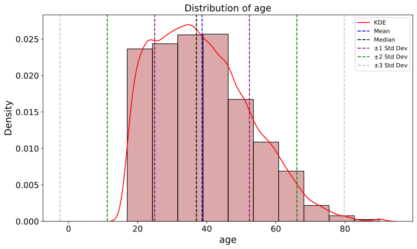
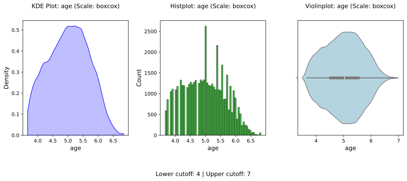

---
title: 'EDA Toolkit: A Lightweight Python Library for Exploratory Data Analysis and Reporting'
tags:
  - Python
  - exploratory data analysis
  - data visualization
  - open source
  - data science
authors:
  - name: Leonid Shpaner
    orcid: 0009-0007-5311-8095
    equal-contrib: true
    affiliation: 1
  - name: Oscar Gil.
    orcid: 0009-0001-9438-7589 
    equal-contrib: true 
    affiliation: 2
affiliations:
 - name: Data Scientist, UCLA Health, United States
   index: 1
   ror: 00hx57361
 - name: Data Scientist, UC Riverside, United States
   index: 2
date: 30 July 2025
bibliography: paper.bib
...


# Summary

EDA Toolkit is a lightweight Python package for conducting and visualizing 
exploratory data analysis (EDA). It provides flexible plotting tools, profiling 
summaries, and exportable Excel reports tailored for both academic and industry 
workflows. Designed to be highly customizable and easily integrated into notebooks 
or pipelines, EDA Toolkit helps users rapidly understand and communicate data 
characteristics.

# Statement of need

Exploratory Data Analysis (EDA) is a critical step in any data science project. 
It helps researchers understand the structure of a dataset, detect data quality 
issues, identify meaningful patterns, and shape the direction of analysis. While 
tools such as `pandas_profiling` and `sweetviz` provide automated reports, they 
often lack the flexibility, transparency, and formatting needed in professional 
or academic settings.

EDA Toolkit addresses these limitations by offering a modular and customizable 
set of tools designed for clarity, reproducibility, and high-quality presentation. 
It supports both academic research and applied data science use cases, with an 
emphasis on producing outputs that are publication-ready and easy to interpret.

More than several examples throughout the documentation and figures in this paper are based 
on the Adult Income dataset from the UCI Machine Learning Repository 
[@uci_adult; @kohavi1996census]. This real-world tabular dataset offers a rich 
foundation for testing demographic segmentation, group comparisons, and reporting 
tools, particularly in contexts involving income classification and social variables. 
It serves as a practical benchmark for demonstrating the capabilities of functions 
such as `generate_table1()` and outlier visualization utilities within the EDA Toolkit.

You can install eda_toolkit directly from PyPI:

```text
pip install eda_toolkit
```

Source code: https://github.com/lshpaner/eda_toolkit  
Documentation: https://lshpaner.github.io/eda_toolkit_docs  
DOI: https://doi.org/10.5281/zenodo.13162633

# Income Distribution by Age Group

To explore income distribution patterns across age groups, we used the 
`stacked_crosstabs()` function. This function generates both raw and normalized 
stacked bar charts, allowing for quick visual comparison of categorical variable 
relationships.

The top panel of the figure displays the count of individuals in each age group, 
broken down by income level (<=50K vs >50K). Younger age groups (18–29 and 30–39)
dominate in population size, but a higher proportion of individuals earning over 
\$50K is observed in the 40–59 range.

The bottom panel presents a normalized version of the chart, where each bar sums 
to 1. This highlights relative prevalence: while most younger individuals earn 
less than $50K, the proportion of higher earners increases notably in the 30–59 
age range. The chart helps identify trends not just in absolute counts but in 
income composition across demographic segments.




# Table 1 Generation

The `generate_table1()` function allows users to produce clean, formatted 
descriptive tables often used in clinical and academic research. The output 
includes summaries by group and supports filtering by data type, making it 
easier to communicate sample characteristics without relying on external tools 
like Excel.

Table: Group-wise descriptive statistics using the `generate_table1()` function on the UCI Adult Income dataset.

| Variable | Count | Proportion (%) | <=50K (n = 37155) | >50K (n = 11687) |
| --- | --- | --- | --- | --- |
| age_group | 48842 | 100.00 | 37155 | 11687 |
| age_group = 18-29 | 13920 | 28.50 | 13174 (35.46%) | 746 (6.38%) |
| age_group = 30-39 | 12929 | 26.47 | 9468 (25.48%) | 3461 (29.61%) |
| age_group = 40-49 | 10724 | 21.96 | 6738 (18.13%) | 3986 (34.11%) |
| age_group = 50-59 | 6619 | 13.55 | 4110 (11.06%) | 2509 (21.47%) |
| age_group = 60-69 | 3054 | 6.25 | 2245 (6.04%) | 809 (6.92%) |
| age_group = 70-79 | 815 | 1.67 | 668 (1.80%) | 147 (1.26%) |
| age_group = < 18 | 595 | 1.22 | 595 (1.60%) | 0 (0.00%) |
| age_group = 80-89 | 131 | 0.27 | 115 (0.31%) | 16 (0.14%) |
| age_group = 90-99 | 55 | 0.11 | 42 (0.11%) | 13 (0.11%) |
| age_group = 100 + | 0 | 0.00 | 0 (0.00%) | 0 (0.00%) |
| marital-status | 48842 | 100.00 | 37155 | 11687 |
| marital-status = Married-civ-spouse | 22379 | 45.82 | 12395 (33.36%) | 9984 (85.43%) |
| marital-status = Never-married | 16117 | 33.00 | 15384 (41.40%) | 733 (6.27%) |
| marital-status = Divorced | 6633 | 13.58 | 5962 (16.05%) | 671 (5.74%) |
| marital-status = Separated | 1530 | 3.13 | 1431 (3.85%) | 99 (0.85%) |
| marital-status = Widowed | 1518 | 3.11 | 1390 (3.74%) | 128 (1.10%) |
| marital-status = Married-spouse-absent | 628 | 1.29 | 570 (1.53%) | 58 (0.50%) |
| marital-status = Married-AF-spouse | 37 | 0.08 | 23 (0.06%) | 14 (0.12%) |


# Outlier and anomaly detection support

The library includes functions to identify and visualize outliers based on 
distributional thresholds or robust statistics. This capability supports 
detecting data quality issues early, understanding variable spreads, and guiding 
preprocessing decisions.

When we examine the age distribution using the `kde_distributions()`, the 
distribution of the age variable is visibly right-skewed, with the kernel density 
estimate (KDE) curve exhibiting a longer tail on the upper end of the age spectrum. 
This indicates that the dataset contains a larger proportion of individuals in the 
younger to middle-aged range, while older individuals are less frequent. The mean age, 
represented by a blue dashed line, is slightly greater than the median (black dashed line), 
further confirming the right-skewed nature of the data. Most of the data fall within 
the $\pm$ 1 standard deviation interval (purple dashed lines), which ranges 
approximately from 25 to 55 years. The $\pm$ 2 and $\pm$ 3 standard deviation bands 
(green and gray lines, respectively) extend out to include nearly the full age range, but 
observations beyond 70 or below 10 are uncommon. The presence of skewness and a small number 
of extreme values justifies the use of a Box-Cox transformation, which was applied in 
subsequent analysis to normalize the distribution and support downstream modeling assumptions.


## Box-Cox Transformation

To correct for right skewness and enhance model interpretability, we applied the 
Box-Cox transformation to the `age` variable using the `data_doctor()` function.
This transformation is designed to normalize positively skewed continuous variables 
by applying a power transformation governed by a parameter $\lambda$, which was 
empirically estimated at **0.1748** for this variable.

The Box-Cox transformation is defined as:

$$
y(\lambda) =
\begin{cases}
\frac{y^\lambda - 1}{\lambda}, & \text{if } \lambda \ne 0 \\\\
\ln(y), & \text{if } \lambda = 0
\end{cases}
$$

Where:  
- $y(\lambda)$ is the transformed value  
- $(y)$ is the original, strictly positive continuous variable  
- $(\lambda)$ is the transformation parameter selected to best approximate normality

The transformed `age_boxcox` variable exhibits improved symmetry and reduced kurtosis, 
making it more suitable for statistical modeling and visualization.


This transformation was applied using the `data_doctor()` function from the 
`eda_toolkit` library, which also produced visual diagnostics (KDE, histogram, 
and boxplot), computed summary statistics, and added a new column `age_boxcox` 
to preserve the transformed values.


The function outputs distribution plots (KDE, histogram, boxplot) on the 
transformed scale, computes summary statistics, and calculates the interquartile 
range (IQR) for potential outlier detection. For this analysis, cutoff filtering 
was disabled, but the lower and upper bounds are shown for reference.

A new column age_boxcox was added to the DataFrame to retain the transformed values 
without overwriting the original data.

```text

            DATA DOCTOR SUMMARY REPORT
+------------------------------+--------------------+
| Feature                      | age                |
+------------------------------+--------------------+
| Statistic                    | Value              |
+------------------------------+--------------------+
| Min                          |             3.6664 |
| Max                          |             6.8409 |
| Mean                         |             5.0163 |
| Median                       |             5.0333 |
| Std Dev                      |             0.6761 |
+------------------------------+--------------------+
| Quartile                     | Value              |
+------------------------------+--------------------+
| Q1 (25%)                     |             4.5219 |
| Q2 (50% = Median)            |             5.0333 |
| Q3 (75%)                     |             5.5338 |
| IQR                          |             1.0119 |
+------------------------------+--------------------+
| Outlier Bound                | Value              |
+------------------------------+--------------------+
| Lower Bound                  |             3.0040 |
| Upper Bound                  |             7.0517 |
+------------------------------+--------------------+

New Column Name: age_boxcox
Box-Cox Lambda: 0.1748

```




# Acknowledgements

We would like to express our deepest gratitude to Dr. Ebrahim Tarshizi, PhD, our 
mentor during our time in the University of San Diego M.S. Applied Data Science 
Program. His unwavering dedication and mentorship played a pivotal role in our 
academic journey, guiding us to successfully graduate from the program and pursue 
successful careers as data scientists. 

We also extend our thanks to the Shiley-Marcos School of Engineering at the 
University of San Diego for providing an exceptional learning environment and 
supporting our educational endeavors.

# References
