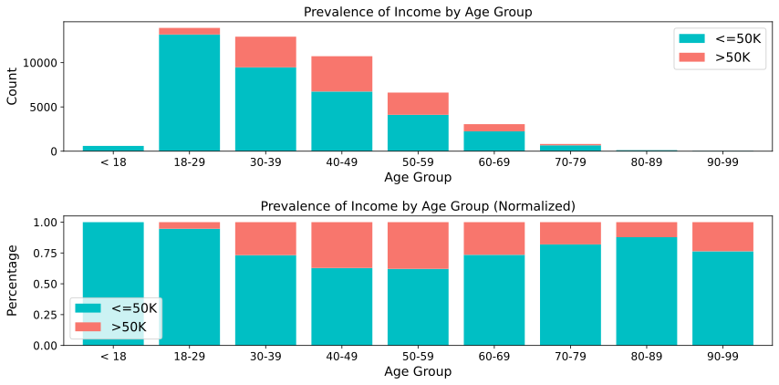
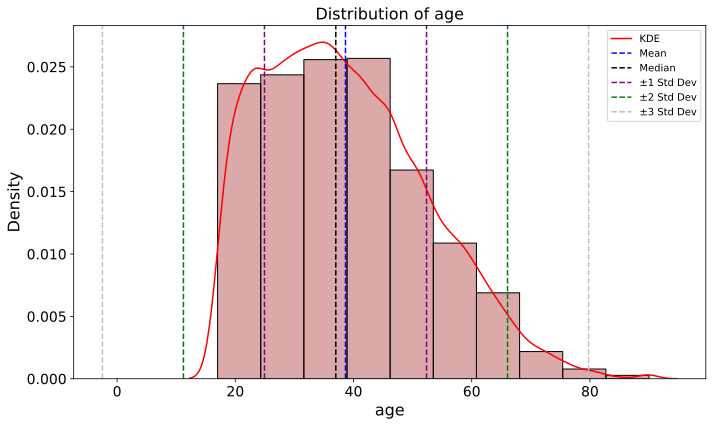
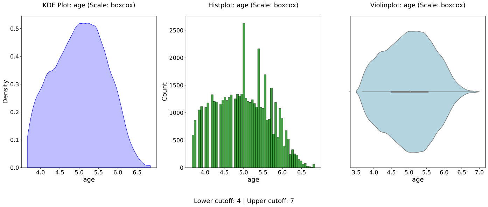

---
title: 'EDA Toolkit: A Lightweight Python Library for Exploratory Data Analysis and Reporting'
tags:
  - Python
  - exploratory data analysis
  - data visualization
  - open source
  - data science
authors:
  - name: Leonid Shpaner
    orcid: 0009-0007-5311-8095
    equal-contrib: true
    affiliation: 1
  - name: Oscar Gil.
    orcid: 0009-0001-9438-7589 
    equal-contrib: true 
    affiliation: 2
affiliations:
 - name: Data Scientist, UCLA Health, United States
   index: 1
   ror: 00hx57361
 - name: Data Scientist, UC Riverside, United States
   index: 2
date: 30 July 2025
bibliography: paper.bib
...


# Summary

EDA Toolkit is a Python library for conducting and visualizing exploratory data 
analysis (EDA). It provides flexible plotting tools, profiling summaries, and 
exportable Excel reports tailored for both academic and industry workflows. 
Designed to be highly customizable and easily integrated into notebooks or 
pipelines, it helps users rapidly understand and communicate data characteristics.

You can install `eda_toolkit` directly from PyPI:

```text
pip install eda_toolkit
```

Source code: https://github.com/lshpaner/eda_toolkit  
Documentation: https://lshpaner.github.io/eda_toolkit_docs  
DOI: https://doi.org/10.5281/zenodo.13162633


# Statement of need

Exploratory Data Analysis (EDA) is a critical step in any data science project. 
It helps researchers understand the structure of a dataset, detect data quality 
issues, identify meaningful patterns, and shape the direction of analysis.

EDA Toolkit offers a modular and customizable set of tools designed for clarity, 
reproducibility, and high-quality presentation. It supports both academic research 
and applied data science use cases, with an emphasis on producing outputs that 
are publication-ready and easy to interpret.

The figures in this paper are based on the Adult Income dataset from the UCI 
Machine Learning Repository [@uci_adult; @kohavi1996census]. This tabular dataset 
offers a rich foundation for testing demographic segmentation, group comparisons, 
and reporting tools. It serves as a practical benchmark for demonstrating the 
capabilities of functions such as `generate_table1()` and outlier visualization 
utilities within the EDA Toolkit.


# Income Distribution by Age Group

The `stacked_crosstabs()` function creates raw and normalized stacked bar charts 
for categorical comparisons.

Figure 1's top panel shows counts of individuals in each age group by 
income level (<=50K vs >50K). Younger groups dominate in size, but higher-income 
proportions peak in ages 40–59. The bottom panel normalizes bars to 1, 
highlighting that while most younger individuals earn under $50K, the share of 
higher earners rises sharply from ages 30–59.

Figure 1: Stacked Bar Graphs of Income by Age Group  




# Table 1 Generation

The `generate_table1()` function produces formatted descriptive tables common in 
clinical and academic research. Outputs summarize by group, filter by type, and 
avoid reliance on external tools.

Table 1: Group-wise descriptive statistics using `generate_table1()` on the Adult Income dataset.

 Variable           | Count  | Proportion (%) | <=50K (n = 37,155) | >50K (n = 11,687) | P-value 
--------------------|--------|----------------|--------------------|-------------------|---------
 fnlwgt_bin         | 48,842 | 100.00         | 37,155             | 11,687            | 0.66    
 fnlwgt_bin = Bin 1 | 42,729 | 87.48          | 32,517 (87.52%)    | 10,212 (87.38%)   |         
 fnlwgt_bin = Bin 2 | 5,898  | 12.08          | 4,466 (12.02%)     | 1,432 (12.25%)    |         
 fnlwgt_bin = Bin 3 | 186    | 0.38           | 148 (0.40%)        | 38 (0.33%)        |         
 fnlwgt_bin = Bin 4 | 22     | 0.05           | 18 (0.05%)         | 4 (0.03%)         |         
 fnlwgt_bin = Bin 5 | 7      | 0.01           | 6 (0.02%)          | 1 (0.01%)         |         
 age_group          | 48,842 | 100.00         | 37,155             | 11,687            | 0.00    
 age_group = 18-29  | 13,920 | 28.50          | 13,174 (35.46%)    | 746 (6.38%)       |         
 age_group = 30-39  | 12,929 | 26.47          | 9,468 (25.48%)     | 3,461 (29.61%)    |         
 age_group = 40-49  | 10,724 | 21.96          | 6,738 (18.13%)     | 3,986 (34.11%)    |         
 age_group = 50-59  | 6,619  | 13.55          | 4,110 (11.06%)     | 2,509 (21.47%)    |         
 age_group = 60-69  | 3,054  | 6.25           | 2,245 (6.04%)      | 809 (6.92%)       |         
 age_group = 70-79  | 815    | 1.67           | 668 (1.80%)        | 147 (1.26%)       |         
 age_group = < 18   | 595    | 1.22           | 595 (1.60%)        | 0 (0.00%)         |         
 age_group = 80-89  | 131    | 0.27           | 115 (0.31%)        | 16 (0.14%)        |         
 age_group = 90-99  | 55     | 0.11           | 42 (0.11%)         | 13 (0.11%)        |         
 age_group = 100 +  | 0      | 0.00           | 0 (0.00%)          | 0 (0.00%)         |         


# Outlier and anomaly detection support

The toolkit includes functions to identify outliers based on distributional 
thresholds or robust statistics. This helps detect data quality issues early, 
understanding variable spreads, and guiding preprocessing decisions.

Using `kde_distributions()`, the age variable shows a right skew, with the KDE 
curve extending into a longer upper tail. The population is concentrated in 
younger to middle ages, with older individuals less frequent. The mean (blue dashed) 
lies slightly above the median (black dashed), confirming the skew. Most observations 
fall within ±1 standard deviation (purple dashed, ~25–55 years), while ±2 and ±3 
SD bands (green and gray) cover nearly the full range. Ages above 70 or below 10 
are uncommon. 

Figure 2: Distribution of Age  



## Box-Cox Transformation

To correct for right skewness and enhance model interpretability, the Box-Cox 
transformation is applied to the `age` variable using the `data_doctor()` function.
This normalizes positively skewed continuous variables by applying a power 
transformation governed by $\lambda$, which is empirically estimated at **0.1748** 
for this variable.

The Box-Cox transformation is defined as:

$$
y(\lambda) =
\begin{cases}
\frac{y^\lambda - 1}{\lambda}, & \text{if } \lambda \ne 0 \\\\
\ln(y), & \text{if } \lambda = 0
\end{cases}
$$

Where:  
- $y(\lambda)$ is the transformed value  
- $(y)$ is the original, strictly positive continuous variable  
- $(\lambda)$ is the transformation parameter selected to best approximate normality

The transformed `age_boxcox` variable exhibits improved symmetry and reduced kurtosis.

```text

            DATA DOCTOR SUMMARY REPORT
+------------------------------+--------------------+
| Feature                      | age                |
+------------------------------+--------------------+
| Statistic                    | Value              |
+------------------------------+--------------------+
| Min                          |             3.6664 |
| Max                          |             6.8409 |
| Mean                         |             5.0163 |
| Median                       |             5.0333 |
| Std Dev                      |             0.6761 |
+------------------------------+--------------------+
| Quartile                     | Value              |
+------------------------------+--------------------+
| Q1 (25%)                     |             4.5219 |
| Q2 (50% = Median)            |             5.0333 |
| Q3 (75%)                     |             5.5338 |
| IQR                          |             1.0119 |
+------------------------------+--------------------+
| Outlier Bound                | Value              |
+------------------------------+--------------------+
| Lower Bound                  |             3.0040 |
| Upper Bound                  |             7.0517 |
+------------------------------+--------------------+

New Column Name: age_boxcox
Box-Cox Lambda: 0.1748
```

Figure 3: Box-Cox Transformed Age




# Acknowledgements

We thank Dr. Ebrahim Tarshizi, PhD, our mentor during the University of San Diego 
M.S. Applied Data Science Program, and the Shiley-Marcos School of Engineering 
for their support.

# References
